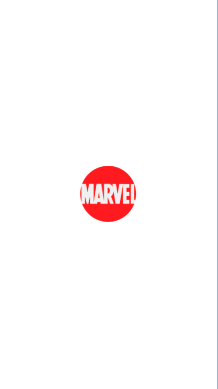
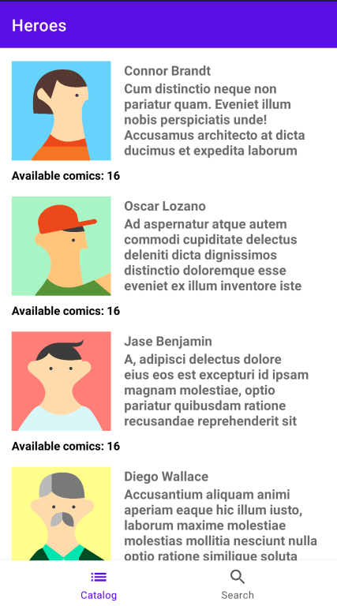
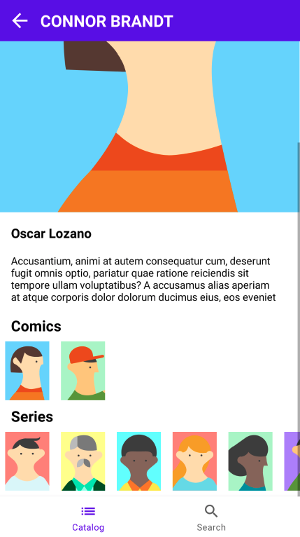
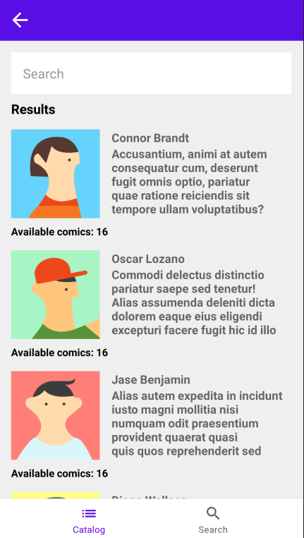

# Heroes

## Introduction

Thank you for participating in the Walmart Training Program!

Here, you'll find instructions for completing the training.

## The Training

The purpose of this training is to reinforce the knowledge and skills about some specific technologies used in Walmart, these technologies are 
(MVVM, RxJava, Retrofit, Navigation Component, Use cases, Interfaces, Gradle, Firebase, Bug fixing)

The goal is to build an application that must include these features using the MARVEL HEROES API:

- A catalog screen of characters that needs to be refactored by adding the MVVM design pattern.
- A detail screen for every character that must show the information that comes from two different services.
- A search screen that needs to show the list of heroes based on the results.
- A splash screen that will block the application if needed.

## Requirements

These are the main requirements we will evaluate:

- Use all that you've learned in the training:
  - Best practices
  - API design
  - UI design
  - Design patterns

## Getting Started

To get started, follow these steps:

1. Fork this project
1. Make your project private
1. Grant your mentor access to the project
1. Commit periodically
1. Apply changes according to the mentor's comments
1. Have fun!

## Deliverables

We provide the delivery dates so you can plan accordingly; please take this challenge seriously and try to make progress constantly.

## First Deliverable (March 29th)

Based on the self-study material and mentorship covered until this deliverable, we suggest you perform the following:

- Update the network client in order to consume observers with the next services using the RxJava adapter:
    - https://gateway.marvel.com/v1/public/characters
    - https://gateway.marvel.com/v1/public/characters/{characterId}/comics
    - https://gateway.marvel.com/v1/public/characters/{characterId}/series

In the next link you can see the official [documentation](https://developer.marvel.com/docs#!/public/getCharacterStoryCollection_get_5)

- Fix the network client, avoid the creation of multiple HeroesServices instances. 
- Work in the catalog screen, add a fragment inside of the MainActivity and show the list of characters in a RecyclerView using a ListAdapter.
- Implement the MVVM design pattern for the catalog screen.
- Implement pagination for the catalog screen, for that, you need to add the offset query in the request.

## Second Deliverable (April 5th)
- Work in the detail screen, add a fragment using the MVVM design pattern, you need to use the comics and series to get the information related to the selected hero in the catalog screen, the idea is to use a flatMap, zip or other advanced operator in order to draw the screen once you have the complete information from both services.
- Extract the business logic from the ViewModel by adding use cases, for that, please create a contract(Interface) that needs to have its own implementation and inject the abstraction in the ViewModel.
- Add an empty fragment called SearchFragment.
- Implement the BottomNavigationView and add two items(Characters and Search).
- Add the navigation graph that contains the fragments and connect the graph with the BottomNavigationView in order to navigate using it.

## Final Deliverable (April 12th)
- Work in the search screen, add the MVVM design pattern and use the characters service by adding the nameStartsWith query.
- Implement pagination for the search screen, you need to add the offset query in the request.
- Work with gradle:
    - Move all constants in the project to the BuildConfig file.
    - Create a QA build variant based on debug.
- Create a firebase project and implement the android sdk in order to use the remote config feature.
    - Add a flag called "isAppBlocked" in the firebase console.
    - Add a splash screen, check if the app should be blocked at start, if so, show feedback to the users to let them know that the application can't be used at the moment.
    
## Mocks

## Documentation

### Self-Study Material

- [Retrofit](https://square.github.io/retrofit/)
- [GSON](https://github.com/google/gson)
- [Picasso](https://square.github.io/picasso/)
- [ViewModel](https://developer.android.com/topic/libraries/architecture/viewmodel)
- [Live Data](https://developer.android.com/topic/libraries/architecture/livedata)
- [Extension functions](https://kotlinlang.org/docs/reference/extensions.html)
- [ConstraintLayout](https://developer.android.com/reference/androidx/constraintlayout/widget/ConstraintLayout)
- [Navigation Component](https://developer.android.com/guide/navigation/navigation-getting-started)
- [RxAndroid](https://github.com/ReactiveX/RxAndroid)
- [Firebase](https://firebase.google.com/docs/remote-config)
- [Interfaces](https://kotlinlang.org/docs/interfaces.html)
- [Variants](https://developer.android.com/studio/build/build-variants)
- [BuildConfig](https://developer.android.com/studio/build/gradle-tips#simplify-app-development)
- [Use Cases](https://proandroiddev.com/why-you-need-use-cases-interactors-142e8a6fe576)
